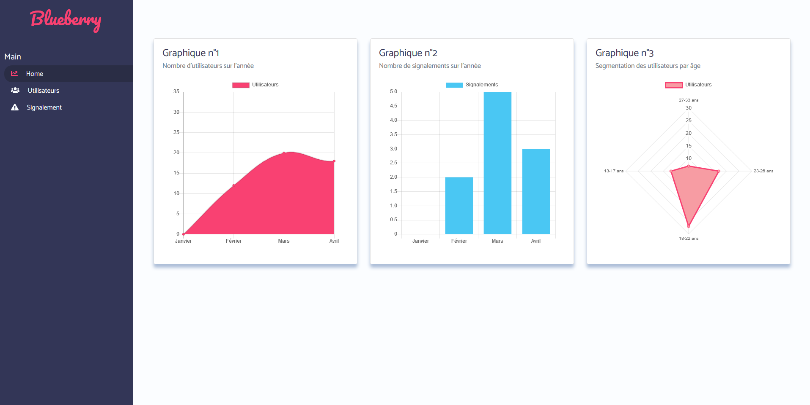
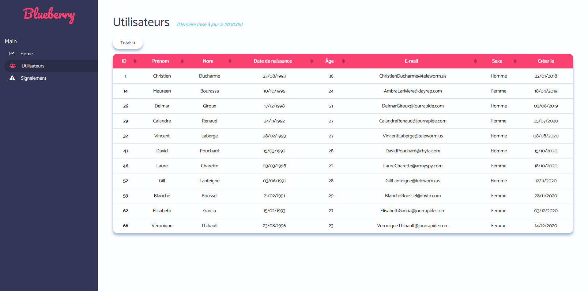
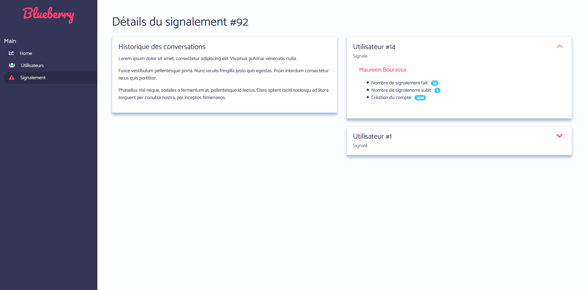

<div align="center">
  
  <h1>Blueberry Dasboard 🍇</h1>

  <p>Administrator dashboard to handle users reports made with VueJS.</p>
</div>


## Resources 📝

* [VueJs](https://vuejs.org/)

I'd highly recommend reading through some of the VueJs documentation.

## Screenshots 📸





## Requirements 📄

To use this web application you will need VueJs.

### Node

- #### Node installation on Windows

  Just go on [official Node.js website](https://nodejs.org/) and download the installer.
  Also, be sure to have `git` available in your PATH, `npm` might need it (You can find git [here](https://git-scm.com/)).

- #### Node installation on Ubuntu

  You can install nodejs and npm easily with apt install, just run the following commands.

      $ sudo apt install nodejs
      $ sudo apt install npm

- #### Other Operating Systems
  You can find more information about the installation on the [official Node.js website](https://nodejs.org/) and the [official NPM website](https://npmjs.org/).

If the installation was successful, you should be able to run the following command.

    $ node --version
    v10.14.2

    $ npm --version
    6.4.1

If you need to update `npm`, you can make it using `npm`! Cool right? After running the following command, just open again the command line and be happy.

    $ npm install npm -g

### VueJs

To install VueJs, just run:
```
npm install vue
```

---

## Install 📥

    $ git clone https://github.com/b0rdjack/blueberry-dashboard.git
    $ cd blueberry-dashboard
    $ npm install

## Running the project 🚀

    $ npm run serve
